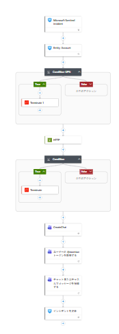
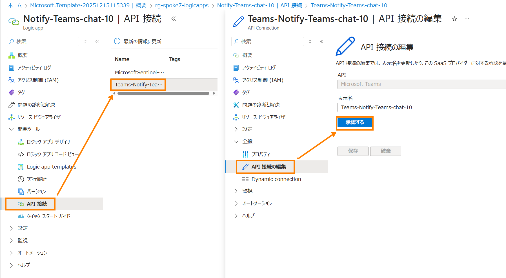
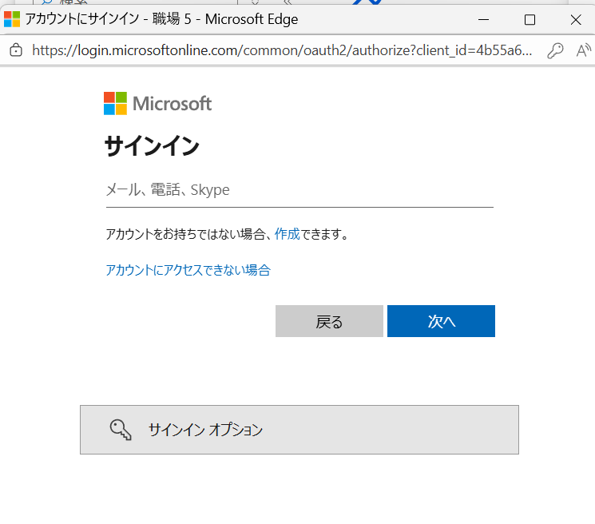
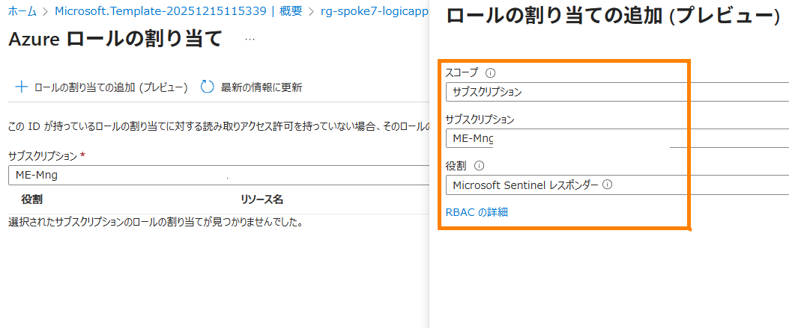

# Notify-Teams-Chat（Logic Apps / Playbook）ARM テンプレート展開手順

## 1. このファイルについて（概要）
このフォルダーにある ARM テンプレート `Notify-Teams-Chat.json` から、Microsoft Sentinel のインシデント作成をトリガーにして、Microsoft Teams のグループチャットを作成し、メッセージ投稿・インシデントタグ付けを行う Logic Apps（Playbook）をデプロイします。



テンプレートは以下の 3 リソースを作成します。

- `Microsoft.Logic/workflows`（Logic Apps: ワークフロー本体）
- `Microsoft.Web/connections`（azuresentinel コネクタ接続）
- `Microsoft.Web/connections`（teams コネクタ接続）

> 注意
> - Teams コネクタはデプロイ後に「接続の認証（サインイン/承認）」が必要です。ARM だけで完全自動化できないケースが多いため、後述の「展開後の作業」を必ず実施してください。
> - ワークフロー内で Microsoft Graph を呼び出す HTTP アクションを **システム割り当てマネージド ID** で実行します。Graph 側の権限付与が必要になる場合があります（後述）。

## 2. 対象ファイル
- `Notify-Teams-Chat.json`
  - デプロイ対象の ARM テンプレートです。
  - 主なパラメーター:
    - `PlaybookName`（既定: `Notify-Teams-chat`）
    - `ChatMembers`（必須）

## 3. 前提条件
- Azure サブスクリプションに対するリソース作成権限（少なくとも対象 RG への Contributor 相当）
- Microsoft Sentinel が有効化された Log Analytics ワークスペースが存在すること
- デプロイ先リージョンで、以下の Managed Connector（managedApis）が利用できること
  - `azuresentinel`
  - `teams`
- Teams 側でチャット作成・メッセージ投稿が許可されるアカウント（コネクタ認証に使用）

## 4. パラメーター
### 4.1 PlaybookName
- Logic App（ワークフロー）名として使用します。
- 既定値: `Notify-Teams-chat`

### 4.2 ChatMembers（必須）
- 追加でチャットに参加させたいメンバー（UPN など）を指定します。
- ワークフロー側では、インシデントに紐づくユーザー UPN と `ChatMembers` を `;`（セミコロン）で連結して Teams のチャットメンバーとして渡します。

推奨入力例（環境に合わせて調整）:

- 1 名: `secops1@contoso.com`
- 複数名: `secops1@contoso.com; secops2@contoso.com`

> 補足
> - 文字列の整形ルールは Teams コネクタ側の仕様に依存します。デプロイ後に実行して、メンバー解決に失敗する場合は区切り文字や空白（スペース）の有無を調整してください。

## 5. 展開方法（Azure Portal）
### 5.1 Deploy to Azure ボタン（推奨）
以下のボタンより、ARM テンプレートからロジックアプリを展開します。

1. 以下の [Deploy to Azure] ボタンをクリックしてデプロイ画面へ遷移します

[](https://portal.azure.com/#create/Microsoft.Template/uri/https%3A%2F%2Fraw.githubusercontent.com%2Fmattu0119%2FSecurity%2Frefs%2Fheads%2Fmain%2Flogicapps%2FNotify-Teams-Chat%2FNotify-Teams-Chat.json)

2. デプロイ先の以下を選択します
   - サブスクリプション
   - リソース グループ（新規作成でも可）
   - リージョン
3. パラメーターを入力します
   - `PlaybookName`（必要に応じて変更）
   - `ChatMembers`（必須）
4. 「確認と作成」→「作成」でデプロイします


### 5.2 手動（テンプレート貼り付け）
1. Azure Portal にサインインします
2. **カスタム テンプレートのデプロイ**（「テンプレートをエディターで作成」または「テンプレートの編集」）を開きます
3. `Notify-Teams-Chat.json` の内容を貼り付け、保存します
4. デプロイ先の以下を選択します
   - サブスクリプション
   - リソース グループ（新規作成でも可）
   - リージョン
5. パラメーターを入力します
   - `PlaybookName`（必要に応じて変更）
   - `ChatMembers`（必須）
6. 「確認と作成」→「作成」でデプロイします

## 6. 展開後の作業（重要）
### 6.1 Teams コネクタ接続の認証（必須）
ARM テンプレートは `Microsoft.Web/connections` を作成しますが、Teams 側の OAuth 認証は通常デプロイ後に実施が必要です。

1. Azure Portal でデプロイしたリソース グループを開きます
2. `Teams-<PlaybookName>`（例: `Teams-Notify-Teams-chat`）の **API 接続** を開きます
3. 「承認」/「編集 API 接続」などから、Teams にサインインして接続を確立します



認証画面が表示されるので、Teams でチャットを作成するユーザーでサインインしてください。


### 6.2 Sentinel コネクタ / 実行権限（確認）
- テンプレートは `azuresentinel` 接続を **Managed Identity** で利用する構成です。
- Logic Apps の Managed ID に付与した 「Sentinel レスポンダー」権限を利用し、インシデントにタグを追加します。

1. Logic Apps の ID より、システム割り当て Managed ID を確認します。
2. `Azure ロールの割り当て` をクリックします。
3. [ロールの割り当ての追加] をクリックします。
4. スコープに、Sentinel が展開されているサブスクリプション or リソースグループを指定します。
5. 役割に [Sentinel レスポンダー] を選択し、保存します。



### 6.3 Microsoft Graph 呼び出し（Managed Identity）の権限（必要に応じて）
ワークフロー内の HTTP アクションが `https://graph.microsoft.com/v1.0/users(...)` を `ManagedServiceIdentity` で呼び出します。

- 実行時に Graph の 401/403 が発生する場合は、Logic App のシステム割り当てマネージド ID（サービス プリンシパル）に対して、Graph のアプリ権限（例: ユーザー情報参照に相当する権限）を付与し、管理者同意が必要になることがあります。

以下は PowerShell（Microsoft Graph PowerShell SDK）を使って、マネージド ID（サービス プリンシパル）に Graph の **アプリ権限（AppRole）** を割り当てる例です。

> 前提
> - 実行者は、対象テナントでアプリ ロール割り当てができる権限（例: グローバル管理者、特権ロール管理者、または該当操作が可能な管理ロール）を保持している必要があります。
> - Microsoft Graph PowerShell SDK を未導入の場合は、事前にインストールしてください（例: `Install-Module Microsoft.Graph -Scope CurrentUser`）。

#### 6.3.1 事前にメモする値
1. Microsoft Entra の **Tenant ID**（テナント ID）
2. **マネージド ID のサービス プリンシパル ID（Object ID）**
   - Azure Portal → 対象 Logic App → **ID（Identity）** → **システム割り当て** → **オブジェクト（プリンシパル）ID** を確認します。


#### 6.3.2 権限を付与（AppRole assignment）
Entra ID ユーザー情報の取得には `User.Read.All` が必要です。Managed ID に Azure ポータルから権限付与できないため、PowerShell 以下のコマンドを実行して権限を付与します。

> 注意（公開情報向け）
> - 以下の `$TenantID` / `$spID` は **プレースホルダー**です。実環境の値に置き換えてください。

```powershell
# テナント ID と先ほどメモしたオブジェクト ID を設定
$TenantID="＜テナントIDを入力＞"
$spID="＜マネージドIDのオブジェクト（プリンシパル）IDを入力＞"

# MS Graph の許可を指定、1 つのみ指定
# 複数必要の場合は「マネージド ID にアクセス許可を設定」のコマンドを繰り返し実施
$PermissionName = "User.Read.All"

# 事前に MS Graph PowerShell にログイン
Connect-MgGraph -TenantId $TenantID -Scopes Application.Read.All,AppRoleAssignment.ReadWrite.All
Import-Module Microsoft.Graph.Applications

# Microsoft Graph のサービスプリンシパルを取得
$GraphServicePrincipal = Get-MgServicePrincipal -Filter "DisplayName eq 'Microsoft Graph'" | Select-Object -first 1

# マネージド ID にアクセス許可を設定
$AppRole = $GraphServicePrincipal.AppRoles | Where-Object {$_.Value -eq $PermissionName -and $_.AllowedMemberTypes -contains "Application"}

$params = @{
  PrincipalId = $spID
  ResourceId = $GraphServicePrincipal.Id
  AppRoleId = $AppRole.Id
}

New-MgServicePrincipalAppRoleAssignment -ServicePrincipalId $spID -BodyParameter $params
```

#### 6.3.3 付与した権限の削除（必要に応じて）
環境整理や切り戻しで、付与した AppRole assignment を削除したい場合の例です。

```powershell
# テナント ID と先ほどメモしたオブジェクト ID を設定
$TenantID="＜テナントIDを入力＞"
$spID="＜マネージドIDのオブジェクト（プリンシパル）IDを入力＞"

# 事前に MS Graph PowerShell にログイン
Connect-MgGraph -TenantId $TenantID -Scopes Application.Read.All,AppRoleAssignment.ReadWrite.All
Import-Module Microsoft.Graph.Applications

# サービスプリンシパルに付与した Microsoft Graph 権限 ID を取得
$roleId = Get-MgServicePrincipalAppRoleAssignment -ServicePrincipalId $spID

# サービスプリンシパルに付与した Microsoft Graph 権限の削除
Remove-MgServicePrincipalAppRoleAssignment -ServicePrincipalId $spID -AppRoleAssignmentId $roleId.Id
```

> 補足
> - Graph のアプリ権限は、割り当て後に反映まで時間がかかる場合があります。

## 7. 動作確認（簡易）
1. Microsoft Sentinel でテスト用インシデントを作成します
2. Logic App の実行履歴でトリガーが起動していることを確認します
3. Teams 側でチャット作成とメッセージ投稿が行われることを確認します
4. インシデントにタグ（例: 「ユーザー確認中」）が追加されることを確認します

## 8. よくある問題
- **Teams 接続が未認証で失敗する**
  - 「展開後の作業 6.1」を実施してください。
- **Graph 呼び出しが 403**
  - 「展開後の作業 6.3」を確認し、マネージド ID への権限付与を検討してください。
- **コネクタがリージョン未対応で失敗**
  - リソース グループのリージョンを変更するか、対象リージョンで `azuresentinel` / `teams` の Managed API が利用可能か確認してください。


