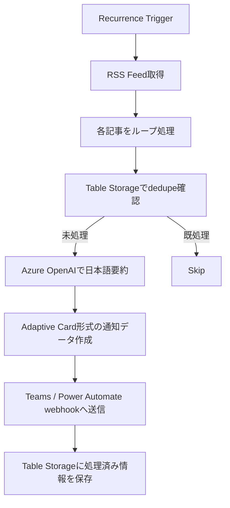

# TechCommunity Blog to Teams Notification Logic App

## 概要

Microsoft Tech Community の対象ブログを定期的に監視し、新着記事を取得して日本語で要約し、Microsoft Teams / Power Automate に通知する Azure Logic App です。

この実装では、以下を自動化します。

- RSS フィードの定期取得
- Azure OpenAI による日本語要約
- Table Storage による重複排除（dedupe）
- Teams / Power Automate webhook への通知

主な用途:

- Microsoft Security 関連ブログの継続的なキャッチアップ
- Security / CSA / SOC チーム向けの情報共有
- 重要な製品更新の見逃し防止

## 全体像

このプロジェクトでできること:

- 複数の Tech Community ブログ RSS を定期的にチェックする
- 新着記事だけを判定して処理する
- 記事内容を日本語で要約する
- Adaptive Card 形式の通知データを webhook に送信する
- 処理済み記事を保存して重複通知を防ぐ

処理の流れ:

1. Recurrence Trigger で一定間隔ごとに実行
2. RSS フィードを取得して各記事を走査
3. Table Storage を参照して処理済みか判定
4. 未処理の記事のみ Azure OpenAI で要約
5. 通知メッセージを生成して webhook へ送信
6. 処理済み記事を Table Storage に保存

## アーキテクチャ



## 構成要素

| コンポーネント | 役割 |
|---|---|
| Azure Logic App | ワークフロー全体の実行、RSS取得、判定、通知 |
| Azure OpenAI | 記事内容の日本語要約 |
| Azure Storage Account | dedupe 用ストレージ |
| Azure Table Storage | 処理済み記事の保存 |
| Teams / Power Automate webhook | 通知の送信先 |
| Managed Identity | Azure OpenAI / Table Storage への認証 |
| Azure RBAC | 必要な権限制御 |

## 監視対象 RSS フィード

- Microsoft Security Blog  
  `https://techcommunity.microsoft.com/t5/s/gxcuf89792/rss/board?board.id=MicrosoftSecurityBlog`

- Microsoft Sentinel Blog  
  `https://techcommunity.microsoft.com/t5/s/gxcuf89792/rss/board?board.id=MicrosoftSentinelBlog`

- Microsoft Defender XDR Blog  
  `https://techcommunity.microsoft.com/t5/s/gxcuf89792/rss/board?board.id=MicrosoftDefenderXDRBlog`

- Microsoft Entra Blog  
  `https://techcommunity.microsoft.com/t5/s/gxcuf89792/rss/board?board.id=MicrosoftEntraBlog`

- Microsoft Defender for Cloud Blog  
  `https://techcommunity.microsoft.com/t5/s/gxcuf89792/rss/board?board.id=MicrosoftDefenderforCloudBlog`

- Microsoft Purview Blog  
  `https://techcommunity.microsoft.com/t5/s/gxcuf89792/rss/board?board.id=MicrosoftPurviewBlog`

- Microsoft Intune Blog  
  `https://techcommunity.microsoft.com/t5/s/gxcuf89792/rss/board?board.id=MicrosoftIntuneBlog`

- Azure Network Security Blog  
  `https://techcommunity.microsoft.com/t5/s/gxcuf89792/rss/board?board.id=AzureNetworkSecurityBlog`

- Microsoft Security Experts Blog  
  `https://techcommunity.microsoft.com/t5/s/gxcuf89792/rss/board?board.id=MicrosoftSecurityExpertsBlog`

## セットアップ

### 前提条件

以下を事前に準備してください。

- Azure サブスクリプション
- デプロイ先リソースグループ
- Azure CLI
- Azure OpenAI の利用権限
- Teams または Power Automate の webhook URL
- 以下のファイル
  - `azuredeploy.json`
  - `azuredeploy.parameters.json`

### デプロイ手順

1. `azuredeploy.parameters.json` を環境に合わせて編集します
2. 以下のコマンドで ARM テンプレートをデプロイします

```azcli
az deployment group create \
  --resource-group <YOUR-RG> \
  --template-file azuredeploy.json \
  --parameters @azuredeploy.parameters.json
```

### デプロイ後に確認すること

デプロイ完了後は、以下を順番に確認してください。

#### 1. Azure リソースが正しく作成されていること

- Logic App が作成されている
- Azure OpenAI リソースが作成されている
- Azure OpenAI deployment が作成されている
- Storage Account が作成されている
- Table Storage (`ProcessedRssItems`) が作成されている

#### 2. Logic App の ID と権限が正しく設定されていること

- Logic App の **System Assigned Managed Identity** が有効になっている
- Azure OpenAI に対して `Cognitive Services OpenAI User` が付与されている
- Storage Account に対して `Storage Table Data Contributor` が付与されている

> RBAC は反映に数分かかる場合があります。初回実行で権限エラーが出た場合は、少し待ってから再実行してください。

#### 3. パラメーターが想定どおり反映されていること

- `pollIntervalMinutes` が意図した間隔になっている
- `feedConfigs` に対象 RSS フィードが入っている
- `teamsWebhookUrl` が有効な URL になっている
- Azure OpenAI のモデル名、バージョン、SKU が想定どおりになっている

#### 4. 初回実行が成功すること

Logic App の実行履歴で、以下のアクションが成功していることを確認します。

- RSS フィード取得
- `Query dedupe entities`
- Azure OpenAI 呼び出し
- webhook 送信
- `Insert dedupe entity`

#### 5. dedupe が正常に動作すること

同じ記事を再度処理した場合に、以下になれば正常です。

- `Query dedupe entities` が既存データを取得できる
- `If not processed` が False 側に進む
- 通知がスキップされる

#### 6. 通知内容が期待どおりであること

- Teams / Power Automate に通知が届く
- 記事タイトルが正しく表示される
- 日本語要約が生成されている
- 原文リンクが正しく開ける

## カスタマイズ
この Logic App は、以下のようにカスタマイズ可能です。

- 監視対象の RSS フィードを追加・削除する
- 通知先を変更する（例: Teams、Power Automate、他サービス）
- 通知内容のフォーマットを調整する（例: タイトル、要約、リンク、カテゴリ）
- Azure OpenAI のモデル、プロンプト、要約方針を変更する
- 実行頻度や通知条件を変更する（例: 特定カテゴリやキーワードのみ通知）
- リトライ、ログ出力、監視などの運用機能を強化する

## 注意点

- Azure OpenAI の利用にはコストがかかるため、実行頻度を高くしすぎないよう注意してください。
- RSS フィードの構造や URL が変更されると、要約や通知内容に影響が出る可能性があります。
- Logic App の動作には、Azure OpenAI と Azure Storage への適切な権限設定が必要です。
- デプロイ直後は RBAC の反映に時間がかかる場合があるため、初回実行で権限エラーが出た場合は少し待って再実行してください。
- 初期運用時は、要約品質、通知内容、dedupe の動作を定期的に確認することを推奨します。
- エラーが発生した場合は、Azure Portal の Logic App 実行履歴を確認して原因を特定してください。

## まとめ
この Logic App を利用することで、Microsoft Tech Community のブログを効率的にキャッチアップし、重要な情報をチーム内で共有することができます。Azure OpenAI を活用して記事内容を日本語で要約することで、情報の理解と共有がさらに促進されます。定期的に Logic App の実行状況を確認し、必要に応じてカスタマイズや改善を行うことで、より効果的な情報共有が可能になります。
